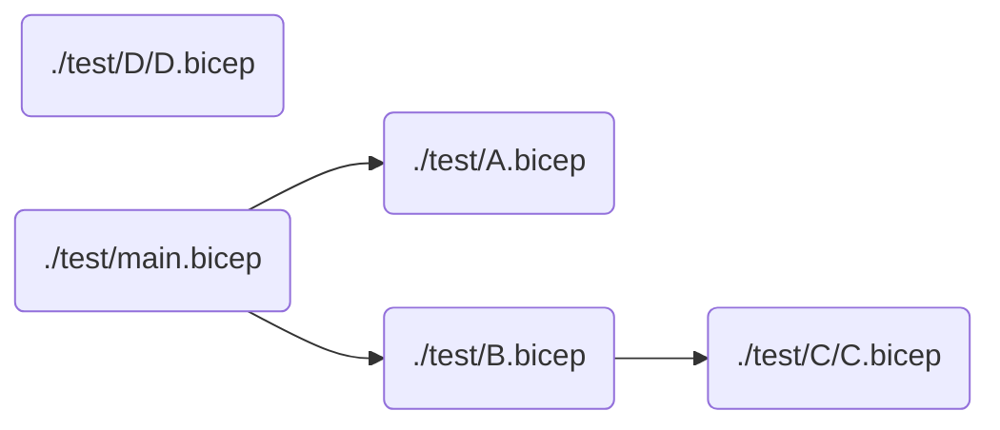

# Bicep Dependency Diagram GitHub Action

This GitHub Action generates a [Mermaid flowchart](https://mermaid.js.org/syntax/flowchart.html) diagram of [Bicep module](https://learn.microsoft.com/en-us/azure/azure-resource-manager/bicep/modules) dependencies.

Example:



## Usage

```yaml
  # you need to check out the bicep files you want to process
  - name: Check out code
    uses: actions/checkout@v4

  # call the action which outputs diagram
  - name: Run action
    id: bicep-dependency-diagram
    uses: maskati/bicep-dependency-diagram@v1

  # you can for example show the diagram on the console and write it to a file
  - name: Show result and save to file
    env:
      DIAGRAM: ${{ steps.bicep-dependency-diagram.outputs.diagram }}
    run: echo "$DIAGRAM" | tee bicep-dependency-diagram.md

  # and upload it as a workflow artifact
  - name: Upload diagram as artifact
    uses: actions/upload-artifact@v4
    with:
      name: bicep-dependency-diagram
      path: bicep-dependency-diagram.md
```

All input parameters are optional. You can also specify parameters:
- `build-method` default `powershell`: Whether to build using [Bicep PowerShell module](https://www.powershellgallery.com/packages/Bicep) (powershell) or [az bicep build](https://learn.microsoft.com/en-us/cli/azure/bicep?view=azure-cli-latest#az-bicep-build) (cli). PowerShell is more efficient at building a large number of files.
- `working-directory` default `.`: Directory from which to generate the diagram. If not provided runs from `GITHUB_WORKSPACE` which is typically the repository checkout root.
- `recurse` default `true`: Whether to generate diagram from bicep files found recursively (true) or only the current directory (false).
- `job-summary` default `true`: Whether to output the diagram to the GitHub job summary (true) or only as the action diagram output (false).

The action emits the `diagram` output parameter. The flowchart is also by default emitted as a job summary which the GitHub web UI [supports rendering as a diagram](https://docs.github.com/en/get-started/writing-on-github/working-with-advanced-formatting/creating-diagrams#creating-mermaid-diagrams).

Examples with parameters:

```yaml
  # build all bicep files recursively from repository root using PowerShell and emit job summary
  - uses: maskati/bicep-dependency-diagram@v1

  # same as above
  - uses: maskati/bicep-dependency-diagram@v1
    with:
      working-directory: .
      recurse: true
      build-method: powershell
      job-summary: true

  # build bicep files in the test directory (non-recursive) using Azure/Bicep CLI and do not emit job summary
  - uses: maskati/bicep-dependency-diagram@v1
    with:
      working-directory: test
      recurse: false
      build-method: cli
      job-summary: false
```
